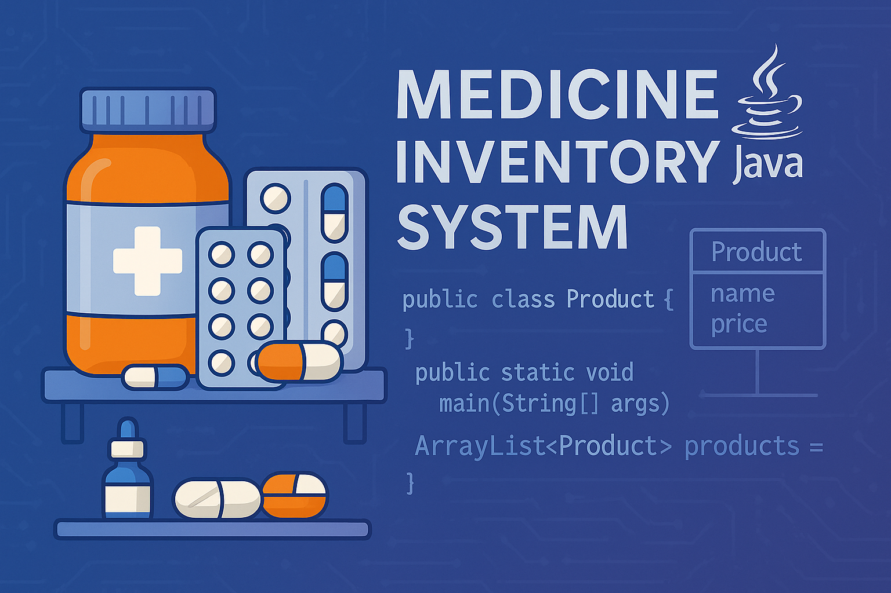

# 💊 Medicine Inventory Project

A Java-based object-oriented application designed to manage and track pharmaceutical inventory in a structured and scalable way.

## 📌 Project Overview
This application allows users to:
- Add, update, and remove medications from stock
- Monitor stock levels and expiration dates
- Generate invoices and usage reports
- Prevent duplicate entries and ensure data integrity

## 🧱 Technologies Used
- **Java** (OOP Principles)
- **ArrayList** for internal storage
- **CLI interface** (basic text-based UI)
- No external libraries required

## 🧠 Key Features
- Product class representing medication objects
- InventoryManager handling core business logic
- Validation logic for quantity and expiration dates
- Simple modular design for scalability

## 🚀 How to Run
1. Clone the repository  
   `git clone https://github.com/AyalaDruk/MedicineInventoryProject`
2. Open in IntelliJ / Eclipse
3. Run `Main.java`

## 📂 Project Structure
```
src/
├── Main.java
├── models/
│   └── Product.java
├── services/
│   └── InventoryManager.java
```

## 👩‍💻 Author
Developed by Ayala Druk  
*As part of an OOP learning project focused on real-world Java applications.*
